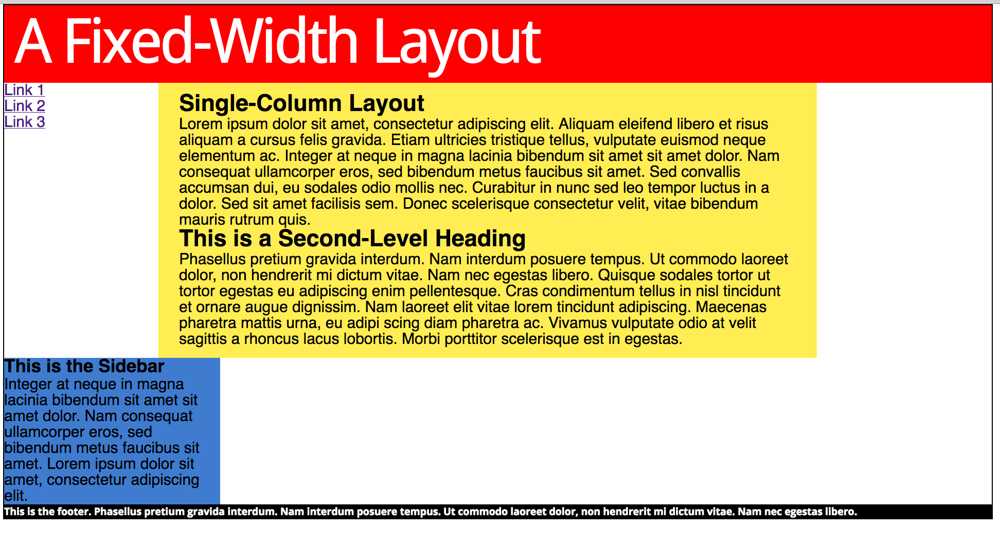

## 页面布局

### 布局的基本概念

多栏布局三种基本的实现方案： 固定宽度、流动、弹性

**固定宽度布局**：

```
大小不会随用户调整浏览器窗口大小而变化，一般是 900 到 1100像素宽。
其中 960 像素是最常见的，因为这个宽度适合所有现代显示器，
而且能够被 16、12、10、8、6、5、4 和 3 整除，
不仅容易计算等宽分栏的数量，而且计算结果也能得到没有小数的像素数。
参考：http://www.960.gs
```

**流动布局**

```
大小会随用户调整浏览器窗口大小而变化。
这种布局能够更好地适应大屏幕，但同时也意味着放弃对页面某些方面的控制，
比如随着页面宽度变化，文本行的长度和页面元素之间的位置关系都可能变化。
Amazon.com 的页面采用的就是流动中栏布局，在各栏宽度加大时通过为内容元素周围添加空白来保持内容居中，
而且现在的导航条会在布局变窄到某个宽度时收缩进一个下拉菜单中，从而为内容腾出空间。

越来越多的浏览器都支持 CSS 媒体查询了。这就让基于浏览器窗口宽度提供不同的 CSS 样式成为可能。
在这种形势下，适应各种屏幕宽度的可变固定布局，正逐步取代流动布局。
这种可变的固定布局能够适应最大和最小的屏幕，业界称之为响应式设计。
```

**弹性布局**：

```
与流动布局类似，在浏览器窗口变宽时，不仅布局变宽，而且所有内容元素的大小也会变化，
让人产生一种所有东西都变大了的感觉。到目前为止，还没有设计得非常好的弹性布局，主要是因为它太过复杂了。
```

#### 布局高度与布局宽度

**布局高度**

```
多数情况下，布局中结构化元素（乃至任何元素）的高度是不必设定的。
事实上，甚至根本不应该给元素设定高度。
除非确实需要这样做，比如在页面中创造一个绝对定位的元素。

为什么正常情况下都应该保持元素 height 属性的默认值 auto 不变呢？
很简单，只有这样元素才能随自己包含内容的增加而在垂直方向上扩展。
这样扩展的元素会把下方的元素向下推，而布局也能随着内容数量的增减而垂直伸缩。
假如你明确设定了元素的高度，那么超出的内容要么被剪掉，
要么会跑到容器之外——取决于元素overflow 属性的设定。
```

**布局宽度**

```
与高度不同，需要更精细地控制布局宽度，以便随着浏览器窗口宽度的合理变化，布局能够作出适当的调整，确保文本行不会过长或过短。
如果随意给元素添加内边距、边框，或者元素本身过大，导致浮动元素的宽度超过包含元素的布局宽度，那浮动元素就可能“躲”到其他元素下方。

即使必须设定栏宽，也不要给包含在其中的内容元素设定宽度，应该让这些内容元素自动扩展到填满栏的宽度。
这是块级元素的默认行为。简言之，就是让栏宽限制其中内容元素的宽度。
```

### 三栏-固定宽度布局

通过把三个浮动容器的总宽度设定为恰好等于外包装的宽度（150 +600 + 210 = 960），就有了三栏布局的框架。

这种办法，可以想加多少栏就加多少栏，只要它们的总宽度等于外包装的宽度即可。

```html
<style>
  * {
    margin: 0;
    padding: 0;
  }

  body {
    font-family: helvetica, arial, sans-serif;
  }

  #wrapper {
    width: 960px;
    margin: 0 auto;
    border: 1px solid;
  }
  article {
    width: 600px;
    float: left;
    background: #ffed53;
  }

  nav {
    width:150px;
    float: left;
  }
  nav li {
    /*去掉列表项目符号*/
    list-style-type:none;
  }
  aside {
    width: 210px;
    float:left;
    background:#3f7ccf;
  }
</style>
<div id="wrapper">

  <nav>
    <!---->
    <ul>
        <li><a href="#">Link 1</a></li>
        <li><a href="#">Link 2</a></li>
        <li><a href="#">Link 3</a></li>
    </ul>
  </nav>
  <article>
    <h1>Single-Column Layout</h1>
    <p>Lorem ipsum ... quis.</p>
    <h2>This is a Second-Level Heading</h2>
    <p>Phasellus pret...egestas.</p>
  </article>
  <aside>
    <h3>This is the Sidebar</h3>
    <p>Integ ... it.</p>

  </aside>
</div>
```

如图:


添加 页头 和 页脚:

```html
<style>
header {
  background: #f00;
}

header h1 {
  font-family: 'Droid Sans';
  font-weight: 400;
  font-size: 4em;
  letter-spacing: -.05em;
  color: #fff;
  padding: 0 0 5px 10px;
}
...
footer {
  background:#000;
  clear: both;
}
footer p {
  font-family: 'Open Sans';
  font-weight: 700;
  font-size: .65em;
  color: #fff;
}
footer a {
  font-family: 'Open Sans';
  font-weight: 700italic;
  font-size: 1em;
  color: #ffed53;
  text-decoration: none;
}
</style>
<div id="wrapper">
  <header>
      <!-- 标题 -->
      <h1>A Fixed-Width Layout</h1>
  </header>
  ...
  <footer>
    <!-- 文本 -->
  </footer>
</div>
```

如图：


**为栏设定内边距和边框**

只要一调整各栏中的内容，布局就可能超过容器宽度，而右边的栏就可能滑到左边的栏下方。

一般来说，两种情况下可能会发生这种问题。

- 为了让内容与栏边界空开距离，为栏添加水平外边距和内边距，或者为了增加栏间距，为栏添加外边距（只要开始给布局添加样式，就一定会采用这里说的一种做法，甚至双管齐下），导致布局宽度增大，进而浮动栏下滑。换句话说，右边浮动的栏因为没有足够的空间与其他栏并列，就会滑到左边栏的下方。

- 在栏中添加大图片，或者没有空格的长字符串（如长 URL），也会导致栏宽超过布局宽度。同样，这种情况下右边的栏也会滑到左边的栏下方。

试试添加内边距，增大内容与栏边界的距离。

```css
article {
 ...
 padding:10px 20px;
}
```

结果:



中间栏中的内容与栏边界之间有了空间，但由于这个栏占据的空间增大，导致右边的栏滑
到了左边的栏下方

3种方法解决这个问题:

- 从设定的元素宽度中减去添加的水平外边距、边框和内边距的宽度和。
  - **重设宽度以抵消内边距和边框**，
  - 但每次只要调整内、外边距就要重设布局宽度，有点烦人。因此这个办法虽然可行，但却不够理想。
- 在容器内部的元素上添加内边距或外边距。
  - 把外边距和内边距应用到内容元素上确实奏效。
    - 前提是这些元素没有明确地设定宽度，这样它们的内容才会随着内、外边距的增加而缩小。
    - 就像盒模型定义所说的，没有宽度的元素在水平方向上会适应其父元素，其内容会随着外边距、边框和内边距的增加而减少。
  - 然而，一栏之中可能会包含大量不同内容的元素。
    - 假如将来又决定调整内容与容器边界的距离，就必须每个元素都要进行调整，这样不仅麻烦，而且容易出错。
    - 况且，给栏添加边框同样会增大栏宽，不可能通过为其包含的内容元素逐个应用样式来做到。
  - 所以说，与其为容器中的元素添加外边距，不如在栏中再添加一个没有宽度的 div，让它包含所有内容元素，然后再给这个 div 应用边框和内边距。
  - 如此一来，只要为内部 div 设定一次样式，就可以把让所有内容元素与栏边界保持一致的距离。
  - 而且，将来再需要调整时也会很方便。任何新增内容元素的宽度都由这个内部 div 决定。
  - 采用这种方法除了标记中多了一个 div 元素外，唯一的问题就是那些反对把标记用于表现用途的纯粹论者会跟你叫嚣。
  - 关于对这个问题的看法，参考附注栏“[关于表现性标记的思考](#关于表现性标记的思考)”，另外一个附注栏“[子-星选择符](#子-星选择符)”也给出了用代码替换内部div 的方案。
- 使用 CSS3 的 box-sizing 属性切换盒子缩放方式，比如 section {box-sizing:border-box;}。
应用 box-sizing 属性后，给 section 添加边框和内边距都不会增大盒子，相反会导致内容变窄。

<span id="关于表现性标记的思考"></span>

**关于表现性标记的思考**

```
HTML 的目的是语义，也就是给内容赋予含义。而 CSS 呢，是为了把表现性的样式分离出来才
发明的。不过，有些表现性标记是有害的，而有些则没有副作用。使用表格来创建多栏布局，
或者使用<br />标签在段间换行，却不使用<p>标签，这种做法的确不值得提倡，因为这会造
成内容难以移植。比如说吧，用三个表格单元作为三栏，这种布局到哪都会显示成表格，就算
是在完全不合适的智能手机里也一样。如果表现性标记无法用 CSS 修改，或者在 CSS 不可用时
也要迫使用户接受，那就是滥用 HTML。可是，div 或 span 这种中性的元素，对默认样式没
有影响，除非你给它们应用样式，否则它们就跟不存在一样。所以，我认为添加这种元素达到
表现性的目的是完全可以接受的。
```

<span id="子-星选择符"></span>

**子-星选择符**


as
