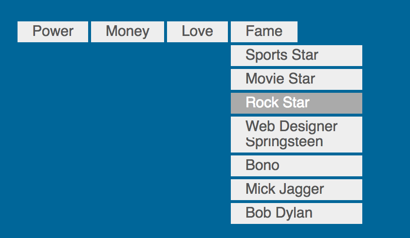
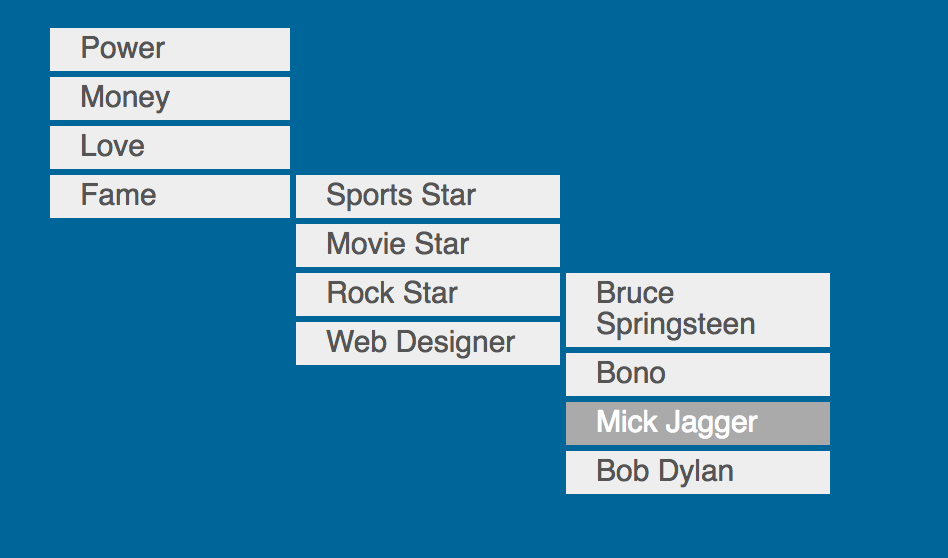
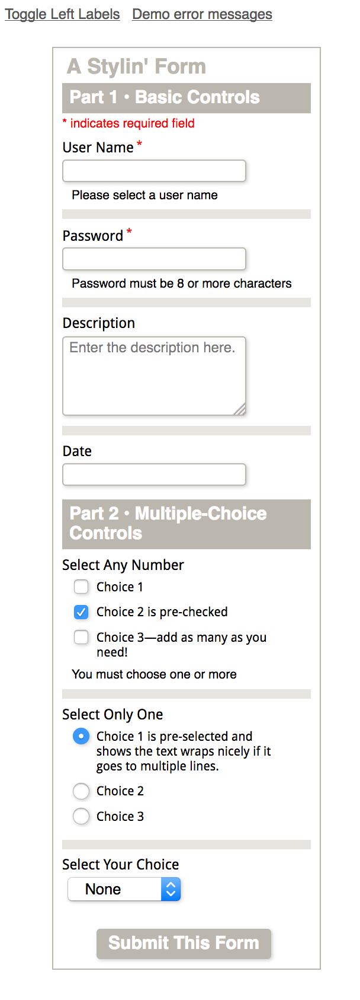
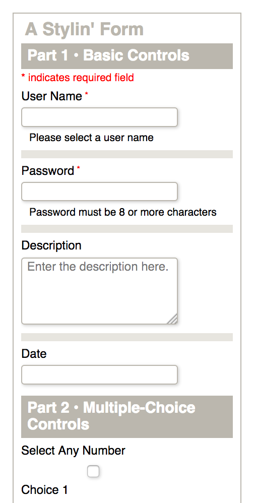
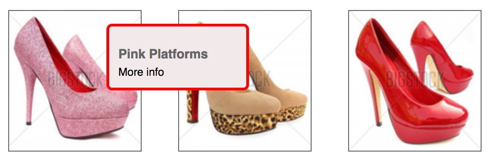

## 界面组建

- [导航菜单](#导航菜单)
  - [纵向菜单](#纵向菜单)
  - [横向菜单](#横向菜单)
  - [下拉菜单](#下拉菜单)
- [表单](#表单)
  - [HTML表单元素](#HTML表单元素)
  - [表单标记策略](#表单标记策略)
  - [设定表单样式](#设定表单样式)
  - [设计搜索表单](#设计搜索表单)
- [弹出层](#弹出层)
  - [堆叠上下文和z-index](#堆叠上下文和zindex)
  - [用CSS创造三角形](#堆叠上下文和)


<span id="导航菜单"></span>

### 导航菜单

菜单由一组链接组成。
用 HTML 中的列表元素（ul 或 ol）来分组链接不仅符合逻辑，而且即使没有额外的 CSS 也能适当显示链接的层次。默认列表项（li）是块级元素，因此它们会上下堆叠。

<span id="纵向菜单"></span>

#### 纵向菜单

**标签**：

```HTML
<nav class="list1">
 <ul>
 <li><a href="#">Alternative</a></li>
 <li><a href="#">Country</a></li>
 <li><a href="#">Jazz</a></li>
 <li><a href="#">Rock</a></li>
 </ul>
</nav>
```

**样式**：

```CSS
/*去掉默认的内边距和外边距*/
* {
  margin: 0;
  padding: 0;
}

/*设定菜单的大小和位置*/
nav {
  margin: 50px;
  width: 150px;
}

/*给菜单加上边框*/
.list1 ul {
  border: 1px solid #f00;
  border-radius: 3px;
  padding: 5px 10px 3px;
}

/*去掉项目符号并为链接添加间距*/
.list1 li {
  list-style-type: none;
  padding: 3px 10px;
}

/*“非首位子元素”选择符 （任何跟在li之后的li） */
.list1 li+li {
  border-top: 1px solid #f00;
}

/*为链接添加样式*/
.list1 a {
  text-decoration: none;
  font: 20px Exo, helvetica, arial, sans-serif;
  font-weight: 400;
  color: #000;
  background: #ffed53;
}

/*悬停高亮*/
.list1 a:hover {
  color: #069;
}
```


**“非首位子元素”选择符** ： 如：`li+li` ， 对于连续的元素，这样，就可以给除第一个 元素 之外的所有元素设定相同的样式。

**同样效果的其他方法** ：

```CSS
/*给所有 li 上方添加一条边框*/
li {
  border-top:1px solid #f00;
}

/*去掉第一个 li 上方的边框*/
li:first-child {
  border-top:none;
}
```

**让列表行可以点击**

目前只有文本是可以点的，因为链接（a）是行内元素，它会收缩并包住其中的文本。然而，更好的用户体验是让列表项所在的整行都能点击。(很多站点都没有这么做)

- 将 `li标签` 的内边距调整到 `a标签`里， 并且 `a标签` 的显示方式调整为 _block_.
- 将 `li标签` 的上边框调整到 `a标签` 中

```CSS
/* 去掉li元素的上边框 */
.list1 li {list-style-type:none;}
/* 调整到a标签的上边框 */
.list1 li + li a {border-top:1px solid #f00;}
/* 调整内边距，显示方式调为 块 显示（让链接完全填满整个列表项） */
.list1 a {display:block; padding:3px 10px;
          text-decoration: none; font:20px Exo, helvetica, arial, sansserif;
          font-weight:400; color:#000; background:#ffed53;}
```

 

<span id="横向菜单"></span>

#### 横向菜单

默认情况下，列表项是垂直堆叠在一起的。不过，要把它们变成水平排列的横向菜单。方法是浮动列表项。

```html
<nav class="list1">
 <ul>
 <li><a href="#">Shirts</a></li>
 <li><a href="#">Pants</a></li>
 <li><a href="#">Dresses</a></li>
 <li><a href="#">Shoes</a></li>
 <li><a href="#">Accessories</a></li>
 </ul>
</nav>
```

```CSS
.list1 ul {
  /*强制 ul 包围浮动的 li 元素*/
  overflow: hidden;
}

.list1 li {
  /*让 li 元素水平排列*/
  float: left;
  /*去掉项目符号*/
  list-style-type: none;
}

.list1 a {
  /*让链接填满 li 元素*/
  display: block;
  padding: 0 16px;
  /*去掉链接的下划线*/
  text-decoration: none;
  color: #999;
}

.list1 li+li a {
  border-left: 1px solid #aaa;
}

.list1 a:hover {
  color: #555;
}
```


这个水平菜单很常见,很多时尚的零售网店都有它们的身影。

- 浮动让 li 元素从垂直变成水平，`display:block` 让链接从收缩变成扩张，从而整个 li 元素都变成了可以点击的。
- 另外，选择符 li + li a 为除第一个链接之外的每个链接左侧都加了一条竖线，作为视觉分隔线。

<span id="下拉菜单"></span>

#### 下拉菜单

下拉菜单是以一组嵌套列表为基础，综合运用刚刚学到的纵向和横向菜单的CSS 技术创建的。


```html
<nav class="multi_drop_menu">
	<!-- 一级开始 -->
	<ul>
		<li><a href="#">Power</a></li>
		<li><a href="#">Money</a></li>
		<li><a href="#">Love</a></li>
		<li><a href="#">Fame</a>
			<!-- 二级开始 -->
			<ul>
				<li><a href="#">Sports Star</a></li>
				<li><a href="#">Movie Star</a></li>
				<li><a href="#">Rock Star</a>
					<!-- 三级开始 -->
					<ul>
						<li><a href="#">Bruce Springsteen</a></li>
						<li><a href="#">Bono</a></li>
						<li><a href="#">Mick Jagger</a></li>
						<li><a href="#">Bob Dylan</a></li>
					</ul>
					<!-- 三级结束 -->
				</li>
				<li><a href="#">Web Designer</a></li>
			</ul>
			<!-- 二级结束 -->
		</li>
	</ul>
	<!-- 一级结束 -->
</nav>
```

为方便设定菜单样式，为列表容器 nav 添加了 _multi_drop_menu_ 类。这个菜单的每一条CSS规则都以 _.multi_drop_menu_ 开头，以确保它们只会应用给带有这个类的容器。

**顶级菜单样式**

```CSS
/*添加视觉样式 开始*/
.multi_drop_menu {
  font: 1em helvetica, arial, sans-serif;
}

.multi_drop_menu a {
  /*让链接充满列表项*/
  display: block;
  /*文本颜色*/
  color: #555;
  /*背景颜色*/
  background-color: #eee;
  /*链接的内边距*/
  padding: .2em 1em;
  /*分隔线宽度*/
  border-width: 3px;
  /*可以有颜色，也可以透明*/
  border-color: transparent;
}

.multi_drop_menu li:hover > a {
  /*悬停时文本颜色*/
  color: #fff;
  /*悬停时背景色*/
  background-color: #aaa;
}

.multi_drop_menu li a:active {
  /*点击时背景变色*/
  background: #fff;
  /*点击时文本变色*/
  color: #ccc;
  /*背景只出现在内边距区域后面*/
  background-clip: padding-box;
}
/*添加视觉样式 结束*/

/*添加功能样式 开始 */
/* 布局，行为，*/
.multi_drop_menu * {
  margin: 0;
  padding: 0;
}

/*强制 ul 包围 li*/
.multi_drop_menu ul {
  float: left;
}

.multi_drop_menu li {
  /*水平排列菜单项*/
  float: left;
  /*去掉默认的项目符号*/
  list-style-type: none;
  /*为子菜单提供定位上下文*/
  position: relative;
}

.multi_drop_menu li a {
  /*让链接填充列表项*/
  display: block;
  /*给每个链接添加一个右边框*/
  border-right-style: solid;
  /*背景只出现在内边距区域后面*/
  background-clip: padding-box;
  /*去掉链接的下划线*/
  text-decoration: none;
}

.multi_drop_menu li:last-child a {
  border-right-style: none;
}

/*临时隐藏低级菜单*/
.multi_drop_menu li ul {
  display: none;
}
/*添加功能样式 结束 */
```


对于CSS的样式，首先要注意把菜单的`视觉样式`与`功能样式`分开来写。

- **视觉样式** : 控制 字体大小 、边框 和 文本的颜色.
- **功能样式** : 控制菜单的 布局 和 行为。

两者的区别主要通过代码注释。
对于像下拉菜单这么复杂的组件，分开来写视觉和功能代码是非常值得提倡的。

这样，将来如果有人要修改菜单外观，只要修改它的 视觉样式 就好了，而 功能样式 可以原封不动。

**注：** _如果在代码中像这样把 视觉样式 与 功能样式 分开来写，一定要用注释说明为什么。_

目前最明显的变化是 li 通过浮动由垂直堆叠变成了水平排列。

至于为了让 ul包围列表项，没有使用 `overflow:hidden`，而是使用了 `float:left`，是因为前者会导致后来添加到下拉菜单中的子菜单无法显示。
【最终会显示在父元素 ul 的外面，结果会因为“溢出”（overflow）而被隐藏（hidden）】。

为了保证用户体验，所有视觉样式——内边距、背景、边框，等等，都要应用给链接 a，而不要应用给 ul 或 li，
以便热区（可点击区域）最大化，让用户鼠标经过时不会产生前面例子中看到的状态切换。
为达到这个目的，同时还要从视觉上分隔链接，使用 `background-clip:padding-box` 声明，这样可以阻止链接的背景（像常规状态下一样）延伸到边框后面。
然后，让边框透明（也可显示为其他实色），在链接之间产生间隙，让后面的页面能够透过边框被看到。
如此一来，不用外边距也能分隔链接，而且鼠标从一个菜单项移动到另一个菜单项时，也不会出现光标切换。
菜单项之间从视觉上是分开，但实际上却是紧挨在一块的。

background-clip 和透明边框的更多用法 ： [css-tricks](https://css-tricks.com/transparent-borders-with-background-clip/)

**注意**：

- 给 li 元素应用了 `position:relative`，这是给添加子菜单做的准备，在当前没有什么效果。
- 最后一行 CSS 隐藏了子菜单，以防显示它们影响我们创建顶级菜单。在后面会有怎么在菜单项处于悬停状态时显示它们。
- 为顶级菜单添加的样式都会被次级菜单继承。【需要应用给子菜单的样式大部分都已经写完啦！】

**菜单的下拉部分**：

虽然子菜单继承顶级菜单的样式为我们提供了方便，但其实有些样式在子菜单中并不是必要的。如：

- 下拉菜单（列表的第二级）是垂直堆叠的，所以不希望其中的列表项继承浮动而变成水平排列。
- 顶级菜单使用右边框作为分隔线，而 下拉菜单 需要使用上边框来分隔垂直堆叠的菜单项。
- 下拉菜单还会用到绝对定位下拉菜单，以便它能精确地对齐父元素（包含子菜单的 li），而这个父元素已经在上一步被设定成相对定位了。
- 为了看到设定的效果，还要显示二级下拉菜单，并继续隐藏三级下拉菜单（下一步再考虑它）。

以下是实现上述改变需要添加的 CSS：

```CSS
/* 添加的视觉样式 */
/*二级菜单宽度*/
.multi_drop_menu li ul {
  width: 9em;
}

.multi_drop_menu li li a {
  /*去掉继承的右边框*/
  border-right-style: none;
  /*添加上边框*/
  border-top-style: solid;
}

.multi_drop_menu li li li a {
  /* 三级菜单的a标签左边框分割 */
  border-left-style: solid;
}

/* 添加的功能样式 */
.multi_drop_menu li ul {
  /*临时显示二级下拉菜单*/
  display: block;
  /*相对于父菜单项定位 使用到了定位上下文,父节点的定位为relative */
  position: absolute;
  /*左边与父菜单项对齐*/
  left: 0;
  /*顶边与父菜单项底边对齐*/
  top: 100%;
}

.multi_drop_menu li li {
  /*停止浮动，恢复堆叠*/
  float: none;
}

.multi_drop_menu li li ul {
  /*继续隐藏三级下拉菜单*/
  display: none;
}
```


二级下拉菜单显示在其父菜单项下方

这一步成功的关键是下拉菜单的 绝对/相对定位 。
通过将其顶边位置（top）设定为100%（相对于其相对定位的父元素 li），其顶边会与父元素底边恰好对齐。
它与父元素之间的间隙，实际上是下拉菜单中第一个链接的边框.

**让下拉菜单响应鼠标事件**

让下拉菜单拥有自己的功能【一开始是隐藏的，只有在其父元素处于鼠标悬停状态时，才需要显示】

```CSS
.multi_drop_menu li ul {
  /*隐藏二级下拉菜单*/
  display: none;
  /*相对于父菜单项定位*/
  position: absolute;
  /*左边与父菜单项对齐*/
  left: 0;
  /*顶边与父菜单项底边对齐*/
  top: 100%;
}

.multi_drop_menu li:hover > ul {
  /*父元素悬停时显示*/
  display: block;
}
```


让菜单起作用的关键在于先把它藏起来：

```CSS
/*隐藏二级菜单*/
li ul {display:none;}

```

然后，再在父元素悬停时把它显示出来：

```CSS
/*显示二级菜单*/
li:hover > ul {display:block;}
/* 当鼠标移动到列表项上时，就显示它的子列表。 */
```

注意，这里的 `:hover 触发器` 是设定在 `li 元素` 而非 链接(a标签) 身上的。
这样做是因为想要显示li 的子元素 ul，而它(a标签)不是想链接的子元素。

此外，为了只显示其子元素，悬停列表项与子列表之间还有一个 **子选择符 `>`**，
如果没有这个子选择符，当顶级菜单项处于悬停状态时，会同时显示二级和三级菜单。

**添加三级菜单**

这时候三级菜单已经算是能用了。只不过位置不对。



由于前面包含:hover 的 CSS 规则会像应用给二级菜单一样，应用给三级菜单，所以在父元素处于鼠标之下时，三级菜单自然也会显示出来。

可是图中的三级菜单被其父元素挡住了。这时候三级菜单与其二级父元素的位置是 二级菜单与顶级菜单的关系 。
所以，三级菜单跑到了鼠标下的二级菜单后面去了，而且其第一项顶边与悬停的父菜单项底边是对齐的。
从图中可以看到，三级菜单第一项“Bruce Springsteen”的上半部分被二级菜单最后一项“Web Designer”给盖住了。

在这一步要做的，就是把三级菜单放到二级菜单右侧，让它的顶边与鼠标所在菜单项的底边对齐。

```CSS
.multi_drop_menu li li ul {
  /*相对于父菜单定位*/
  position: absolute;
  /*与父菜单右侧对齐*/
  left: 100%;
  /*与父菜单项顶边对齐*/
  top: 0;
}
```

现在的菜单能用了，可以在顶级添加更多列表项，在标记中添加更多子列表，然后无须多写一行 CSS，它们就能构成新的下拉菜单。

此时，还应该再作两个调整。
首先，为了真正让这些代码有用，而且可以重用，需要再写一些样式，让顶级菜单能够 `垂直显示`，以便能将其用在导航 `侧边栏` 里。
为此，我得先给 nav 容器添加第二个类 _vertical_。

```HTML
<!-- HTML 类名之间要有空格 -->
<nav class="multi_drop_menu vertical">
```

```CSS
/* CSS 类名之间没有空格 */
/* .multi_drop_menu.vertical */

/*只在导航容器有 vertical 类的情况下才起作用*/

/*顶级垂直菜单宽度*/
.multi_drop_menu.vertical {
  width:8em;
}

.multi_drop_menu.vertical li a {
  border-right-style:none;
  border-top-style:solid;
}
.multi_drop_menu.vertical li li a {
  border-left-style:solid;
}

.multi_drop_menu.vertical ul,
.multi_drop_menu.vertical li {
 /*让顶级菜单垂直显示*/
 float:none;
}

.multi_drop_menu.vertical li ul {
 /*子菜单左边与上一级菜单右边对齐*/
 left:100%;
 /*子菜单顶边与上一级菜单项顶边对齐*/
 top:0;
}
```



为了让菜单恢复默认的堆叠状态，这里重置了顶级 li 元素及其父元素 ul 的浮动属性，后者原来浮动是为了包围浮动的 li 元素。

这里还为 nav 容器设定了宽度。如果不设定导航容器宽度，那么 nav 及其包含的顶级菜单项都会尽可能伸展。最后，把二级菜单与顶级菜单的位置关系，设定成了前面三级菜单和二级菜单之间的关系，即让子菜单顶边与父菜单项顶边对齐。当然去掉了顶级菜单项的右边框，代之以上边框.

**突出显示选择路径**


只有位于鼠标下方的元素才会突出显示。为了让用户明确地知道自己是怎么一路选择下来的，还需要让每一级菜单中被选择的元素突出显示。
实际上只要把 `.multi_drop_menu a:hover` 替换成以下 CSS 即可。

```CSS
.multi_drop_menu li:hover > a {
 /*悬停时的文本颜色*/
 color:#fff;
 /*悬停时的背景颜色*/
 background-color:#aaa
}
```

这个小小的替换能够起作用，是因为:hover 事件会沿着元素的结构层次 “向上冒泡”。
所以，把 `:hover 设定在 li 元素`，就相当于也把它设定给了所有祖先 li 元素。
然后，只要再给其子元素（链接）设定样式即可。这个改进能够极大地提高菜单的易用性，下拉菜单到此讲完了，最终结果如上图所示。

有了以上 CSS 文件，只要把它链接到页面中，并给一个包含无序列表的容器加上 multi_drop_menu 类，该列表就会摇身一变，成为一个全功能的菜单，

<span id="表单"></span>

### 表单

表单与其他页面元素的作用不同。

其他元素是把服务器发过来的内容显示给用户，
而表单则是把用户的信息发送给服务器。

作为设计者，当然希望用户能够顺利地使用表单，从而得到他们的反馈、意见、联系信息……当然——还有他们的信用卡号。

大型表单的复杂程度较高，电商网站的购物车就是一例。假如设计得不好，让用户觉得费解，很可能转眼之间就丢掉了生意。可见，设计的品质是可以用白花花的银子来衡量的。

关于表单设计的参考 [Web Form Design: Filling in the Blanks](http://www.lukew.com/resources/web_form_design.asp)

<span id="HTML表单元素"></span>

#### HTML表单元素

**HTML5表单**

HTML5 为 input 元素新增了 13 种新类型（type 属性），也对表单进行了大幅增强，包括特别特别棒的 placeholder 属性，可以在文本框中显示说明文字（例如“在这里填写用户名”），只要用户一开始输入它就会消失。

了解新增的 HTML5 表单标签和属性，以及浏览器对它们的支持情况，可以参考[这个网页](http://wufoo.com/html5) 和 [html5forms](http://www.html5rocks.com/en/tutorials/forms/html5forms).

更详细的input标签介绍：[INPUT - Form Input](http://htmlhelp.com/reference/html40/forms/input.html) 和 [html-form-tutorial](http://www.javascript-coder.com/html-form/html-form-tutorial-p1.phtml)
标签：

```html
<!-- 必要的 form 标签 -->
<form class="stylin_form1" action="process_form.php" method="post">
	<h3>A Stylin' Form</h3>
	<!-- 控件组，即各种控件的容器 -->
	<fieldset>
		<!-- 控件组的文字说明，或标题 -->
		<legend><span>Part 1 &#8226; Basic Controls</span></legend>
		<!-- 开始单行文本输入控件 -->
		<section>
			<p class="note">* indicates required field</p>
			<!-- for 属性把标注与控件关联起来，它的值必须与控件 ID 值相同 -->
			<label for="user_name">User Name<span> *</span></label>
			<!-- text 属性让这个控件可以输入文本 -->
			<input type="text" id="user_name" name="user_name" />
			<p>Please select a user name</p>
		</section>
		<!-- 开始密码控件 -->
		<section>
			<label for="password">Password<span> *</span></label>
			<!-- 密码文本显示为掩码 -->
			<input type="password" id="password" name="password" maxlength="20" />
			<p>Password must be 8 or more characters</p>
		</section>
		<!-- 开始多行文本输入控件 -->
		<section>
			<label for="description">Description</label>
			<textarea id="description" name="description" placeholder="Enter the description here."></textarea>
		</section>
		<!-- 开始 HTML5 日期控件 -->
		<section>
			<label for="description">Date</label>
			<input type="date" id="special_date" name="event_date" min="2012-09-05" />
		</section>
	</fieldset>
	<fieldset>
		<legend><span>Part 2 &#8226; Multiple-Choice Controls</span></legend>
		<!-- 开始复选框 -->
		<section>
			<h4>Select Any Number</h4>
			<section>
				<input type="checkbox" id="check1" name="checkset" value="1" tabindex="4" />
				<label for="check1">Choice 1</label>
			</section>
			<section>
				<input type="checkbox" checked="checked" id="check2" name="checkset" value="2" />
				<label for="check2">Choice 2 is pre-checked</label>
			</section>
			<section>
				<input type="checkbox" id="check3" name="checkset" value="3" />
				<label for="check3">Choice 3&mdash;add as many as you need!</label>
			</section>
			<p>You must choose one or more</p>
		</section>
		<!-- 开始单选按钮 -->
		<section>
			<h4>Select Only One</h4>
			<section>
				<input checked="checked" id="radio1" name="radioset" type="radio" value="Choice_1" />
				<label for="radio1">Choice 1 is pre-selected and shows the text wraps nicely if it goes to multiple lines.</label>
			</section>
			<section>
				<input id="radio2" name="radioset" type="radio" value="Choice_2" />
				<label for="radio2">Choice 2</label>
			</section>
			<section>
				<input id="radio3" name="radioset" type="radio" value="Choice_3" />
				<label for="radio3">Choice 3</label>
			</section>
		</section>
		<!-- 开始选项列表（下拉列表） -->
		<section>
			<label for="select_choice">Select Your Choice</label>
			<select id="select_choice" name="select_choice">
			 <option value="0">None</option>
			 <option value="1">Choice 1</option>
			 <option value="2">Choice 2</option>
			 <option value="3">Choice 3</option>
			 <option value="4">Choice 4</option>
			</select>
		</section>
	</fieldset>
	<!-- 开始提交按钮 -->
	<section>
		<input type="submit" value="Submit This Form" />
	</section>
</form>
```



基于常用表单元素创建的表单

**form 元素**

所有表单的标记都包含在一个 form 元素中。

```html
<form class="stylin_form1" action="process_form.php" method="post">
  <!-- 这里是表单标记 -->
</form>
```

form 元素有两个必要的属性：action 和 method。

action 属性用于指定服务器上用来处理表单数据的文件的 URL。

method（值要么是 post，要么是 get）用于指定怎么把数据发送到服务器。

服务器处理表单数据参考：[html-form-tutorial](http://www.javascript-coder.com/html-form/html-form-tutorial-phtml)。网页底部还有不少与表单相关的链接，

**提交表单**

用户提交表单后，他们在 `表单控件` 中填写的表单数据或者做出的选择，都会被发送到服务器。

- 控件，是对表单中用来收集数据的各种表单组件的通称，包括 `文本框`、`复选框`、`单选按钮`，等等。
- 表单中的数据是以“名=值”的形式发送给服务器的，比如 “username=chrisconsumer”，每个控件都是这么一个 名/值 形式。
- 这里的“名”就是你在控件 name 属性中设定的名字。
- 这里的“值”可能是用户在文本控件中输入的信息，也可能是表示可选控件（如复选框）中某一项是否被选中的 布尔状态值（比如某个复选框中用 1 表示选中，用 0 表示未选中）。

_在确定这些控件的名字时，最好跟编程人员以及数据库管理员共同协商，得到一个大家都认可的命名方案。_

**控件组**

可以把一组相关的表单控件组织到一个控件组元素 fieldset 中。

比如: 在一个电商网站上， 用于收集用户姓名和地址的控件组 ，可能会加上一个标题叫“收货人信息”。随后可能就是另一个 用于填写信用卡信息的控件组 。

前面表单标记使用了两个 fieldset 元素，把所有控件分成了两组。

第一组包含基本的标注和控件，第二组包含更复杂的控件，比如复选框（type="checkbox"）、单选按钮（type="radio"）和选项列表（select）。

fieldset 的第一个子元素一定得是 legend文本元素，其中包含这个控件组的标题。

```html
<fieldset>
 <legend>Mailing Address</legend>
 <!--- 标注和控件 -->
</fieldset>
```

**控件与标注**

表单包含一或多个控件。如前所述，控件就是让用户勾选、点选、输入的组件。
对于那些可以输入的控件，大家又俗称其为字段。
每个表单控件（submit 按钮除外），都有一个对应的 label 文本元素，用于描述控件代表的数据。

```html
<label for="user_name">User Name</label>
<!-- 创建一个文本字段 -->
<input type="text" id="user_name" name="user_name" />
<p>Please select a user name</p>
```

label 元素可以包含控件，也可以放在控件前头或后头。
如果像前面那样没有用 label包含控件，那么 label 的 for 属性与控件的 id 属性必须匹配，以便把两者关联起来。

不过，控件与标注之间的关系是隐式存在的，而且如果 label 像下面这样包含控件，其 for 属性也不是必需的：

```html
<label>User Name<input type="text" name="user_name" />
</label>
```

_for 属性与 id 属性通过相同的值关联起来后，用户点击标注文本也可以选择单选按钮和复选框。_

无论采用哪种方式关联标注与控件都没问题，重要的是一定要有这种关联。这种关联对于屏幕阅读器等辅助技术解读表单非常关键。

个人习惯于把 label 放在控件前面（当然对于 复选框 和 单选按钮，还是要放在后面），因为这样更方便设定样式。
除了标记和控件，有时候还需要告诉用户如何填写或选择，特别是在需要填写特定格式数据（如日期）的时候。
HTML 中没有为表单控件说明规定什么标签，因此就用 p 这个段落元素吧。
另外，说明的文字最好方便在用户输入无效数据的情况下突出显示（比如变成红色），这样就不用单独准备和控制错误消息了。后面会介绍怎么做到这一点。

_当然，如果希望在用户输入无效数据时显示不同于说明的错误消息，可以再添加一个 p 元素，并赋予它.error 类。_

**控件类型**

最常用的 HTML 表单元素是 input , 因为它可以在屏幕上显示为多种不同的外观，并具有不同的行为。
文本框、复选框、单选按钮等的背后都是 input 元素，区别在于它们的 type 属性。

下面列出了 type 属性部分可能的值：

- text：基本的单行文本框。
- password：文本显示为掩码。
- checkbox：复选框。
- radio：单选按钮。
- submit：提交表单的按钮。
- time、date、search：HTML5 文本框的变体。

这些类型值决定了相应 input 元素的外观和行为。

type 属性的所有值可参考： [MDN-firefox](https://developer.mozilla.org/en-US/docs/Web/HTML/Element/Input) 和 [中文版](https://developer.mozilla.org/zh-CN/docs/Web/HTML/Element/Input)

有一个文本控件不是 input 元素的变体，那就是多行文本区 textarea 元素。另外，在用户输入之前一直显示的占位符文本，是通过 placeholder 属性设定的。

**复选框、单选按钮和选项列表**

这三种表单元素比一般的控件/标注组合要复杂一些：

- 复选框可以让用户从多个备选项中选择一或多个项。每个备选项都是非排他型的，即勾选同一组中的其他项，不会影响已经选择的项。
- 单选按钮限制用户只能从多个备选项中选择一项。每个备选项都是排他型的，即勾选同一组中的另一项，就会取消对前一项的选择。
  - 特别注意一下，复选框和单选按钮都是成组出现的，分组的方法是为它们设定相同的 name 属性。
  - 本例中的单选按钮，它们共同的名字叫 radioset。这个组中的每个单选按钮由其 value 属性唯一标识。
  - 本例中，分别是 Choice_1、Choice_2，等等。假设用户选择了第一个按钮，那么发送到服务器的名/值对，就是 radioset=Choice_1。
- 选项列表（select 元素）会创建一个下拉列表，用户可以在其中点选。在 select元素中，每个备选项都用 option 文本元素来生成。

HTML 中的所有表单元素，可以参考这里：[form-elements](https://www.sitepoint.com/web-foundations/form-elements/)

<span id="表单标记策略"></span>

#### 表单标记策略

因为 HTML 标准没有规定专门包含控件及其标注的元素，所以可以用块级 section元素来充当这个角色。
这样既方便组织控件，又方便为行内表单控件及其标注设定样式。

**基本的标注和控件**

在前面的标记中，把每个标注和控件都放到了一个 section 元素中，让 label 位于控件之前。

```HTML
<section>
 <label>…</label>
 <input />
 <p>…</p> <!-- 控件使用说明 -->
</section>
```

通过把每一对标注和控件都放到块级 section 元素中，它们自然就在页面上垂直堆叠起来了。而且，这样也有了一个可以定位它们的包含元素。

**复选框和单选按钮**

单选按钮和复选框是由很多标注/控件组成的，所以把它们都放到了一个 section元素中（便于为标注/控件设定基本的 CSS 样式）。
然后，在这个元素里面，再把每个复选框或单选按钮的标注/控件分别放到各自的 section 元素中。

```html
<section>
 <h4>Set Heading</h4>
 <!-- 第一个单选按钮/复选框 -->
 <section>
 <input />
 <label>…</label>
 </section>
 <!-- 第二个单选按钮/复选框 -->
 <section>
 <input />
 <label>…</label>
 </section>
 <!-- 控件使用说明 -->
 <p>…</p>
</section>
```

这时候，把标注放到了控件后面，这样它才能显示在控件右侧。
虽然每个控件（复选框和单选按钮）都有一个对应的标注，但不能将它们用作整个控件组的标题。
每个 label 元素只能用于标注一个控件。为此就用一个 h4 元素来作为它们的标题。
如前所述，还添加了一个 p 元素，用于显示控件使用说明。
HTML 未来的版本中或许会专门规定这些特定用途的标签。
但在此之前，到底选用什么标签来达到目的，还是会因人而异。

<span id="设定表单样式"></span>

#### 设定表单样式

首先，从表单的整体布局开始。【就是先设定 form 和两个 fieldset 元素的样式。】

```CSS
form.stylin_form1 {
 width:14em; /* 表单整体宽度 */
 margin:20px auto; /* 在容器内居中 */
 border:1px solid #bbb7ae;
 padding:.5em .5em .15em;
 }
.stylin_form1 h3 { /* 表单主标题 */
 margin:0;
 padding:0 0 .2em .2em;
 font-weight:600;
 color:#bbb7ae;
 }
.stylin_form1 fieldset { /*包含控件与标注*/
 margin:0;
 padding:0 0 .2em 0;
 width:100%;
 border:0;
 }
/* legend 元素的位置不同寻常，所以我把它的文本包含在一个块级 span 中，转而为 span
设定样式 */
.stylin_form1 legend {
 width:100%;
 padding:.3em 0;
 background:#bbb7ae; /*灰色条*/
 }
.stylin_form1 legend span { /* 设定标题文本的样式 */
 display:block;
 font-size:1em;
 line-height:1.1em;
 padding: 0 0 0 .4em;
 font-weight:700;
 color:#fff; /*灰色条上的反白文本*/
 }
```

通过为 form 设定内边距，它所包含的内容都与表单边界空开了距离。
很明显，给 legend 添加了灰色条，相应地把文本设定成了白色。
legend 元素默认的位置是由浏览器内部的一种未加说明的机制确定的，并不是由浏览器样式表设定的。因此，不可能通过 CSS 来精确控制它的位置。
解决这个问题的方法，就是把它的文本包含在一个 span 元素中，将该元素设定为 display:block，然后再设定该元素的位置。

接下来，从宏观到微观，给控件组（fieldset）中的控件和标注设定样式:

```CSS
.stylin_form1 section {
  overflow: hidden;
  /* 强制 section 包含表单控件及标注 */
  padding: .2em 0 .4em 0;
  border-bottom: 8px solid #e7e5df;
  /* 根据需要在每个 section 间增加间距 */
}

.stylin_form1 section:last-child {
  /* 每组最后一个 section 没有边框 */
  border-bottom: 0px;
}

.stylin_form1 section label,
/* 表单控件的标注 */

.stylin_form1 section h4 {
  /* h4 是复选框和单选按钮组的标题 */
  display: block;
  clear: both;
  margin: .3em .3em 0 0;
  /* 右外边距确保标注文本在碰到 input 之前会换行 */
  padding-bottom: .1em;
  font-size: .8em;
  font-family: 'Droid Sans';
  font-weight: 400;
  line-height: 1.1;
}

.stylin_form1 section label span,
/* 星号表示必填字段 */

.stylin_form1 section h4 span {
  font-size: .75em;
  vertical-align: text-top;
  color: #f00;
}

.stylin_form1 section p.note {
  /*说明星号是必填字段的文本*/
  font-size: .7em;
  color: #f00;
  margin: 0;
  padding: 0 0 .3em 0;
}

.stylin_form1 section input,
.stylin_form1 section textarea,
.stylin_form1 section select {
  margin: .2em .5em .2em 0;
  padding: .2em .4em;
  /* 给 input 中的文本添加间距 */
  color: #000;
  box-shadow: 1px 1px 3px #ccc;
  font-size: .8em;
  /* 针对 Firefox - 没有这条声明会在 textarea 上使用 Courier */
  font-family: inherit;
  outline: none;
  /* 去掉默认蓝色聚焦轮廓线 */
}
/* 设定文本字段（文本、密码、日期、文本区等）的样式，并加圆角 */

.stylin_form1 section input,
.stylin_form1 section textarea {
  width: 12em;
  /*设定字段宽度*/
  border: 1px solid #bbb7ae;
  border-radius: 3px;
  /*圆角边框*/
}

.stylin_form1 section textarea {
  height: 5em;
  /* textarea 的高度 */
  margin-top: .3em;
  /* 与上面 label 的间距 */
  line-height: 1.1;
}

.stylin_form1 section p {
  /*控件使用说明*/
  margin: .3em .75em 0;
  clear: both;
  font-size: .7em;
  line-height: 1.1;
  color: #000;
}

.stylin_form1 section p.error {
  color: #f00;
  /* 添加 error 类，把说明文字设定为红色 */
}
```



把所有控件的可见盒子（类型为 text、date、textarea 和 select）都设定为相同宽度，为说明文字应用了样式，并给每个 section 元素添加了较宽的边框，让它们从视觉上保持适当距离。

某些标注后面的星号表示相应字段是必填的，也就是用户不能不填。
这个（用 Shift-8）输入的星号被包含在 span 元素中，以便调整它与标注文本的相对位置，并应用不同颜色。
注意，还为控件使用说明段落设定了一条 p.error 规则。
如果控件中数据无效，这个类就会被添加到说明段落上。然后，说明文字会变成红色，提醒用户必须输入有效数据才能提交表单。

*这个 error 类将由验证表单的代码添加*

下面该轮到复选框、单选按钮和选项列表了。
这些控件全都位于第二个控件组中。它们的标注都在控件下方，应该让这些标注与控件并排显示。

```css
/* 复选框和单选框 */
.stylin_form1 section section {
  /* 控件/标注的内包装 */
  overflow: hidden;
  /* 强制元素包围浮动标注 */
  margin: .2em 0 .3em .4em;
  padding: 0 0 .1em 0;
  border-bottom: none;
}

.stylin_form1 section section input {
  /*单选按钮或复选框*/
  float: left;
  clear: both;
  width: auto;
  /* 重设继承的宽度 */
  margin: .1em 0 0em .3em;
  /* 顶部与标注对齐，左侧防止 intput 溢出 */
}

.stylin_form1 section section label {
  float: left;
  clear: none;
  /* 重设继承的值 */
  width: 15em;
  margin: .15em 0 0 .6em;
  /* 在相邻的复选框之间、复选框与标注之间增加间距 */
  font-weight: normal;
  /* 重设继承的值 */
  font-size: .7em;
  line-height: 1.2;
}

.stylin_form1 section select {
  margin-left: .4em;
  font-size: .85em;
}

.stylin_form1 section input[type="submit"] {
  /*提交按钮*/
  width: auto;
  /* 覆盖为其他字段设定的宽度 */
  margin: .4em .3em 0 0;
  font-size: 1em;
  font-weight: 800;
  color: #fff;
  background-color: #bbb7ae;
  cursor: pointer;
  /*在鼠标位于按钮之上时，把光标变成小手形状*/
}

.stylin_form1>section:last-child {
  /*居中提交按钮*/
  text-align: center;
}
```


复选框、单选按钮和提交按钮已经各就各位

每一组单选按钮和复选框的标题，看起来很像表单第一个控件组里的标注。
但实际上，它们是 h4 元素——我们只能用 label 来关联控件。
正因为如此，要把同样的样式设定给 h4 很简单，把为表单第一个控件组中的 label 设定样式的选择符中的 label替换成 h4 即可。
然后，给这里每个复选框和单选按钮的小标注另外写一种样式。
为了让选项列表与其他元素对齐，我们也为它设定了相应的样式，通过减小其文本大小也把它缩小了一点。
至于提交按钮，它的宽度不再继承前面设定给其他 input 的规则，并且在表单底部居中。
明确告诉用户，这是表单的最后一个步骤。

*在为 name 属性设定同一个名字的情况下，复选框和单选按钮的行为就像一个组一样。提交表单时，它们的 name 值与 value 值，将分别作为“名=值”对中的“名”和“值”。*

接下来让表单的标注显示在控件的左侧。使用这个“标注在左”版的样式也很简单，只要给 form 元素加上 labels_left 类即可。

```CSS
form.stylin_form1.labels_left {
  width: 22em;
  /*加宽表单，为标注腾出地方*/
}

form.stylin_form1.labels_left label,
form.stylin_form1.labels_left h4 {
  float: left;
  /*把标注浮动到控件左侧*/
  width: 8em;
}

form.stylin_form1.labels_left p {
  margin: 0 0 0 9.35em;
  /*缩进控件说明，以便它位于控件正下方*/
  padding: .3em 0 0 0;
  clear: both;
  /*确保说明不会跟着浮动的标注和控件走*/
}

form.stylin_form1.labels_left p.note {
  /*必填字段文本下方的间距*/
  margin: 0 0 .2em 0;
}

/*每个单选按钮或复选框及其标注的内包装*/
form.stylin_form1.labels_left section section {
  width: 10em;
  margin-left: 6.5em;
  padding-top: 0;
}

form.stylin_form1.labels_left section section input {
  width: 1.25em;
  /*单选按钮或复选框的宽度*/
  margin-left: 0;
}

.stylin_form1.labels_left section input,
.stylin_form1.labels_left section textarea,
.stylin_form1.labels_left section select {
  float: left;
  /*让控件成为第二栏*/
  width: 12em;
}

.stylin_form1.labels_left section select {
  /*缩进选项列表*/
  margin-left: .2em;
}

/*防止提交表单按钮继承浮动的行为*/
.stylin_form1.labels_left>section input[type=submit] {
  float: none;
}
```


<span id="设计搜索表单"></span>

这个例子涉及的那么多 HTML 和 CSS 代码，一定深深体会到了为表单添加样式多么复杂，多么耗时间。
正因为如此，这里对原型式表单的标记进行了精心设计，而且写了很多注释，以方便轻松地把它作为自己设计表单的起点。
直接复制粘贴 HTML 代码也好，模仿其结构再添加需要的各种控件也罢，别忘了把这个表单 CSS 链接到页面中。
然后，给 form 元素加上 stylin_form1 类，表单一下子就能变成现在这个样子。
以此为起点，进行各种改进和增强，就会非常容易了。

作者自己就是这样做的，这样每次都能节省好几个钟头的时间。

#### 设计搜索表单

几乎每个站点都会提供一种搜索机制。恐怕很难把一个搜索框当成一个表单，但它的确是一个字段的表单。
搜索表单提供了简单的搜索功能，它随时恭候在标题栏的右侧，那儿几乎是它的专属位置。
苹果网站上那个小巧、低调的搜索框，在用户点击它的时候会扩展开来，为输入关键词提供更多空间。
它旁边甚至连一个按钮都没有——用户都知道点击、输入，然后再按 Return 或回车键。
这种搜索表单的 form 元素中只需要包含一个 label 和一个 input。
在下面的例子中，会把这个表单放在一个 header 标签中，以便得到一个包含搜索功能的页眉。

```html
<header>
 <form class="stylin_form_search1" action="#" method="post">
   <label for="search">search</label>
   <input type="search" id="search" name="search" placeholder="search" />
 </form>
</header>
```

借这个例子，正好可以讲一讲 CSS3 的过渡功能。过渡可以基于某个 CSS 属性实现动画效果。

在这个例子中，要利用它实现文本框动态变宽的效果。

对应的CSS 如下：

```CSS
* {
  margin: 0;
  padding: 0;
}

header {
  /*在这个例子中代表页眉*/
  font-family: helvetica, arial, sans-serif;
  display: block;
  overflow: hidden;
  width: 300px;
  margin: 30px;
  border-radius: 6px;
  background-color: #ddd;
}

form.stylin_form_search1 {
  /*包含 label 和 input 的容器*/
  float: right;
  width: 200px;
  margin: 5px;
  padding: 5px;
}

form.stylin_form_search1 input {
  float: right;
  width: 70px;
  padding: 2px 0 3px 5px;
  outline: none;
  /*去掉默认的突显轮廓线*/
  font-size: .8em;
  border-color: #eee #ccc #ccc #eee;
  /*针对其他浏览器的厂商前缀*/
  border-radius: 10px;
  -webkit-transition: 2s width;
}

form.stylin_form_search1 input:focus {
  width: 200px;
}

form.stylin_form_search1 label {
  /*标注是必要的，但不用显示出来*/
  display: none;
}
```


这里的 form 元素是“有宽度的”，而且是向右浮动的。
表单内部的 input 也是向右浮动。
虽然 label 元素没有显示出来，但它是必须要加的。
文本框中的文本由 placeholder 属性生成，只要用户一开始输入，这些占位符文本就会自动隐藏。

**运用 CSS3 过渡**

在前面的 CSS 中，input 规则将该字段宽度设定为 70 像素，input:focus 规则将该字段宽度修改成了 200 像素。
这意味着，在用户单击搜索框让它获得键盘焦点之后，字段宽度会改变。
不过，由于现在有了 transition:2s width;声明，字段不会突然扩展到新宽度，而是会用两秒钟时间平滑地伸展到 200 像素。

必须注意，`CSS3 的过渡声明要放在设定初始状态的规则中`。而且，transition 属性需要使用带厂商前缀的形式【这里只示范了带有 WebKit（Safari/Chrome）前缀的属性】。

**附注：CSS3 过渡**

CSS3 过渡可以让 CSS 属性产生动画效果。平常被某些事件触发时变化很突然的样式。 比如：鼠标悬停时改变链接颜色，使用过渡后会在指定的时间段内逐渐变化。
第一条 CSS 规则设定属性的初始状态和过渡参数。
第二条 CSS 规则设定事件发生时属性的目标状态。

在下面这个例子中，用户单击表单输入字段后，输入框的边框颜色会从黑色变化为绿色，过渡周期为两秒钟。

```CSS
input {border-color:black; transition:border-color 2s;}
input:focus {border-color:green;}
/* 请注意，使用 transition 属性时要针对所有浏览器添加厂商前缀。 */
```

通常，过渡动画是由用户鼠标悬停时的 :hover 伪类规则 和 表单元素获得焦点时 的 :focus 伪类规则 触发的。
除此之外，还可以在一个带类名选择符的规则中设定新状态，然后通过 JavaScript（或 jQuery、MooTools 等 JavaScript 库）为元素添加这个类名来触发过渡，添加类名的时机可以是鼠标点击或其他事件发生时。

有五个过渡属性：

- transition-property，过渡的 CSS 属性名，比如 color、width；
- transition-duration，过渡的持续时间，以秒或毫秒设定，比如 2s、500ms；
- transition-timing-function，过渡的调速函数，决定动画效果是否平滑，是先慢后快还是先快后慢，比如 ease-in、ease-out、ease-in-out 或 linear（默认值）；
- transition-delay，过渡开始前的延迟时间，以秒或毫秒设定，比如 1s、200ms；
- transition，过渡的简写属性，例如 transition:color 2s ease-in 1ms;

很多（并非全部）CSS 属性都可以通过 transition 属性来实现动画效果。

至于哪些属性可以实现动画效果，可以参考 [animatable-properties](http://www.w3.org/TR/css3-transitions/#animatable-properties)，这个页面是 W3C 对 CSS3 Transitions Module 的官方陈述。

下面这篇介绍 CSS3 过渡的文章也非常值得一看：[An Introduction to CSS3 Transitions](http://www.css3.info/preview/css3-transitions)。

<span id="弹出层"></span>

### 弹出层

弹出层（也叫提示条）指的是在鼠标悬停于某个元素之上时显示的一个界面组件。
在页面空间有限的情况下，弹出层是为用户提供更多信息的一种有效手段。
而且，在用户把鼠标移动到关注的元素之上时，显示一个弹出层也是件自然而然的事儿。
乍一听，弹出层不是个太复杂的东西。
但是，一会儿你就知道我为什么把它放在本章最后才讲了。
围绕创建弹出层，会跟大家讲两个 CSS 中非常强大，但又没多少人真正理解的特性：`z-index 属性` 和 `动态生成 HTML 元素`。

会在接下来的练习中用到三张图片，每张图片都配一个图题。

以下就是练习的 HTML 标记，其中使用了HTML5 新增的 figure 和 figcaption 元素。

```HTML
<figure>
  
  <figcaption>
    <h3>Pink Platforms</h3>
    <a href="#">More info</a>
  </figcaption>
</figure>
<figure class="click_me">
  
  <figcaption>
    <h3>Leopard Platforms</h3>
    <a href="#">More info</a>
  </figcaption>
</figure>
<figure class="click_me">
  
  <figcaption>
    <h3>Red Platforms</h3>
    <a href="#">More info</a>
  </figcaption>
</figure>
```

**注意：** 如果要使用 figcaption，必须确保它在 figure 中是唯一的。而且，它要么是第一个子元素，要么是最后一个子元素。

首先，设定 figure 元素的样式，让它在视觉上成为一个包围图片的盒子。

```CSS
figure {
  width: 144px; /*图片盒子宽度*/
  height: 153px;  /*图片盒子高度*/
  margin: 20px 20px;  /*图片盒子间距*/
  border: 1px solid #666;  /*图片边框*/
  position: relative;  /*为弹出层提供定位上下文*/
  float: left;  /*让图片并排显示*/
}

img {
  display: block;  /*去掉图片下方的基线空白*/

}
```


figure 元素的边框之内恰好能容纳图片，而且浮动也让它们并排显示在一行。
figcaption 元素目前就显示在它默认的位置，但下一步它就会变成弹出层。

为什么把图片设定为 display:block 呢？因为图片默认是行内元素，**行内元素的定位原则是与文本基线对齐**，而不是与它们容器的底边对齐。在把它们放在块级元素内部时（像这里一样），把图片转换为块级元素可以解决这个问题。
另外，这里还把 figure 元素设定为 *相对定位* ，这样随后就可以把它作为定位上下文来定位figcaption 了，下面就是相应的样式。

```CSS
figcaption {
  display: none;  /*隐藏弹出层*/
  position: absolute;  /*相对于容器（图片）定位*/
  left: 74%;
  top: 14px;  /*把弹出层放到图片右侧*/
  width: 130px;  /*弹出层宽度*/
  padding: 10px;  /*弹出层内边距*/
  background: #f2eaea;
  border: 3px solid red;
  border-radius: 6px;
}

figure:hover figcaption {display: block;} /*鼠标悬停在图片上时显示弹出层*/

figcaption h3 {
  /*弹出层的内容*/
  font-size: 14px;
  color: #666;
  margin-bottom: 6px;
}

figcaption a {
  /*弹出层的内容*/
  display: block;
  text-decoration: none;
  font-size: 12px;
  color: #000;
}
```

这里又用到了实现下拉菜单时的技术，即先隐藏弹出层，然后在鼠标悬停时再显示它。
为了把弹出层定位在图片盒子的右侧，把它的 left 属性设定为 74%。或许有人认为在这里应该使用 right 属性，但那样就是设定图片盒子右边与弹出层右边的相对位置了。


鼠标移动图片上时，会在弹出层中显示图题。可是，前两个截图的弹出层被右边的图片给挡住了

<span id="堆叠上下文和zindex"></span>

#### 堆叠上下文和z-index

从图中的截图来看，其中一张图片的弹出层被右边的图片给挡住了一部分。

这是由于 figure 元素的堆叠次序导致的。

在一个包含多个同辈元素的容器内，这些同辈元素都会构造一个堆叠上下文。【就像这里 body 元素的三个 figure 子元素一样】

在这个上下文中，它们的子元素会上下堆叠起来。
假如通过定位让前两个 figure 元素重叠，那么你会发现第一个 figure 元素，以及它的堆叠上下文中的所有子元素，都将位于第二个 figure 元素的后面。
第一个插图的弹出层属于第一个 figure 元素的堆叠上下文，因此它默认会在第二个 figure 元素的堆叠上下文中所有元素的后面。

CSS 中有一个 z-index 属性，用于控制元素的在堆叠上下文中的次序。【通过它可以改变元素堆叠时的默认次序。】

z-index 值较大的元素，在堆叠层次中位于z-index 值较小的元素上方。

z-index 属性的值可以是 0 到任意大的数值；负值也可以，但在某些浏览器中并不可靠。

默认情况下，所有堆叠元素的 z-index 的值为 auto，相当于 0。

不过，z-index 只对那些 position 值为 static 之外的元素有效。【涉及的两个元素必须是 absolute、relative 或 fixed 定位才行】。

在例子中，弹出层已经是绝对定位了，其位置相对于相对定位的 figure 元素。所以，只要给弹出层应用大于 0 的 z-index 值，就可以让它们在堆叠中处于最高层。这里，我们把 z-index设定为 2。

```CSS
figure:hover figcaption {
  display: block;
  z-index:2;/*把弹出层放到最前面*/
}
```



在给弹出层设定了较大的 z-index 属性后，它们就能显示在所有图片之前了

这个例子告诉我们，应该只给悬停状态设定 z-index 属性，而不要试图通过设定个别元素的 z-index 来确保元素不会重叠。只要坚持“悬停时设定 z-index”，就能放心地摆放图片，而且知道在触发弹出层时，它一定会显示在页面的最前面，如图所示。

<span id="用CSS创造三角形"></span>

#### 用CSS创造三角形

使用三角形对接的边框让弹出层和图片的关系更加明确。

源码:

```HTML
<style>
div {
 border:12px solid;
 border-color:transparent red transparent transparent;
 height:0px;
 width:0px;
}
</style>

<div></div>
```

通过加宽盒子的边框，将盒子的宽和高都设定为 0，同时将其他三个边框设定为 transparent，就可以用 CSS 造出一个三角形。


其他类型的如：

```HTML
<html>
<head>
<meta charset="utf-8" />
<title> Creating a CSS Triangle</title>
<style>
div {margin:20px 30px; float:left;}
div.step1 {
	border:12px solid;
	border-color:red;
	height:30px; width:30px;
	bottom:100%; left:140px;
	color:#000;
	}
div.step2 {
	border:12px solid;
	border-color:orange red green gray;
	height:30px; width:30px;
	bottom:100%; left:140px;
	color:#000;
	}
div.step3 {
	border:12px solid;
	border-color:orange red green gray;
	height:0px; width:0px;
	bottom:100%; left:140px;
	color:#000;
	}
div.step4 {
	border:12px solid;
	border-color:transparent red transparent transparent;
	height:0px; width:0px;
	bottom:100%; left:140px;
	color:#000;
	}
</style>
</head>

<body>
	<div class="step1"></div>
    <div class="step2"></div>
    <div class="step3"></div>
    <div class="step4"></div>
</body>

</html>

```


把这个技术与::before 伪元素结合起来。【::before 和::after 这两个伪元素是用于添加文本或图标等少量内容的。】
可以为它们生成的内容设定任何样式，就像给标记中其他元素设定样式一样。
在这把伪元素生成内容的盒子，通过 CSS 制作成一个三角形，并把它放到弹出层的左边。

```CSS
figcaption::after { /*红色三角形的盒子*/
   content:""; /*需要有内容，这里是一个空字符串*/
   position:absolute; /*相对于弹出层定位*/
   border:12px solid;
   border-color:transparent red transparent transparent;
   right:100%; top:17px; /*相对于盒子边框定位三角形*/
   height:0px; width:0px; /*收缩边框创造三角形*/
}
```

如图：


a
